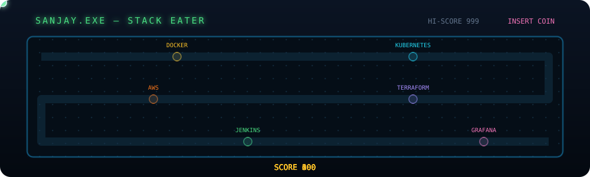

<div align="center">



<a href="https://linkedin.com/in/sanjayvasudevan"></a>
<a href="mailto:sankir25092007@gmail.com"></a>
<a href="https://github.com/sanjayvasudevan-c"></a>


## `> ./whoami.sh`




## `> kubectl get projects --all-namespaces`



</div>

### The big three

<table>
<tr>
<td width="50%" valign="top">

#### 🛰️ [SatQuery](https://github.com/sanjayvasudevan-c/Geo_Logics) · `14,925 lines`
`python` `sentinel-1/2` `CORINE` `segmentation`

Ask a natural-language question about a satellite scene, get back an **exact, auditable answer** with calibrated confidence and a full execution trace.

The insight: the benchmark's ground truth was *generated by a program* over land-cover rasters — counts, areas, adjacency are measurements, not opinions. So SatQuery reproduces that process instead of guessing its output. One model predicts a 44-class CORINE Level-3 map; a **deterministic geometry engine** computes the answer from it.

> *Predict what needs perception; calculate what can be calculated.*

</td>
<td width="50%" valign="top">

#### 📚 [CourseC](https://github.com/sanjayvasudevan-c/AI_powered_learning) · `7,234 lines`
`python` `compiler` `SQLite IR` `typed passes`

**A course compiler.** Feed it one chapter PDF; get back a graph of concepts — anchored to a syllabus, linked as prerequisites, backed by cited evidence — and from that graph a lesson, assessment items, and a booklet.

Source material is the *input language*, the **Concept Graph** is the *IR*, each stage is a *typed compiler pass*, rendering is *codegen*. Passes own their columns and a pass writing outside its lane is a caught defect, not a future refactor. Nothing here is one long prompt.

</td>
</tr>
<tr>
<td colspan="2" valign="top">

#### 💻 [kodeZ](https://github.com/sanjayvasudevan-c/kodeZ) · `4,112 lines`
`fastapi` `postgres` `alembic` `argon2` `github-oauth`

Backend for a real-time developer collaboration platform. Modelled as seven bounded resources — `users`, `groups`, `members`, `invitations`, `messages`, `repositories`, `refresh_tokens` — each with its own schema, router and migration.

Security is not a middleware afterthought: **Argon2** password hashing, rotating **refresh tokens** as first-class rows, **GitHub OAuth** for repo linking, and dependency-injected auth guards (`api/deps.py`) that every protected route declares explicitly. Alembic migrations and a pytest suite ship with it.

</td>
</tr>
</table>

### Everything else

| Project | Stack | Lines | What it is |
|---|---|--:|---|
| [**GeoLogics**](https://github.com/sanjayvasudevan-c/GeoLogics) | `python` `scipy` `flask` | 4,684 | The rules-first cut of SatQuery. A band-arithmetic classifier builds the land-cover map; every question about it — counts, areas, adjacency, position — is answered by `scipy.ndimage` connected-component and morphology ops, **never** by a language model. Ships `DECISIONS.md` and a `make setup / data / test` flow. |
| [**codeZ**](https://github.com/sanjayvasudevan-c/codeZ) | `python` `javascript` | 1,380 | The earlier prototype the kodeZ backend grew out of — the collaboration model before it was split into bounded resources. |
| [**Operating-Systems**](https://github.com/sanjayvasudevan-c/Operating-Systems) | `c` `shell` | 792 | Eleven OS lab exercises, from system calls up: CPU scheduling, IPC, semaphores, Banker's algorithm, deadlock detection, threading, paging, memory allocation. |
| [**job**](https://github.com/sanjayvasudevan-c/job) | `node` | 302 | Résumé keyword extraction and role matching — parses a PDF into a structured profile and scores it against a role catalogue. |
| [**new-app**](https://github.com/sanjayvasudevan-c/new-app) | `next.js` `fastapi` `postgres` `docker` | 191 | `edu-os` — a Next.js + TypeScript frontend and FastAPI backend wired together under one `compose.yaml`, with the Postgres schema versioned alongside. |
| [**Jenkins-zero-to-hero**](https://github.com/sanjayvasudevan-c/Jenkins-zero-to-hero-) | `jenkins` `docker` | 33 | A Node service carried end-to-end by a `Jenkinsfile`: build → test → containerise → deploy, with `docker-compose` for the local ring. Small on purpose — the pipeline is the artifact. |
| [**DAA_LAB**](https://github.com/sanjayvasudevan-c/DAA_LAB) | `c` | — | Design & Analysis of Algorithms lab: implementations plus measured performance analysis (interpolation search and friends). |

<div align="center">


## `> kubectl apply -f deploy.yaml`




## `> terraform apply`




## `> watch -n1 metrics`




## `> ./stack.sh --orbit`




<br/>

<br/>


## `> ./play.sh --game=snake`



### `> snake --eat=contributions`


</div>

## `> cat achievements.log`

```console
[WIN ]  BNB Chain Agentic Hackathon
[TOP ]  Finalist — 2x inter-college hackathons & coding competitions
[LEAD]  President, Technical Club — workshops, events, 20+ students mentored
[EVNT]  Conducted Dakshashila — flagship college cultural event
[CERT]  FastAPI (Udemy) · Jenkins (Udemy)
[PUB ]  Research: "Efficient IoT-Based Monitoring Systems for Industrial Applications"
[OSS ]  Published open-source project on GitHub
```

<div align="center">


## `> gh stats`


<br/>


</div>
